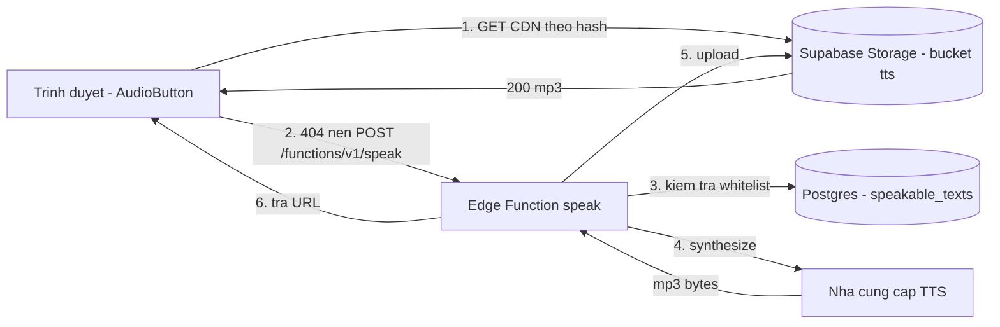

# Phương án kỹ thuật — Audio phát âm qua Supabase

> Trạng thái: **không dùng cho bản hiện tại.** Mã của M1 và M2 đã viết xong và
> có test, nhưng sản phẩm đang phát âm bằng file sinh sẵn tại máy (Piper) —
> xem mục "Vì sao không dùng dịch vụ TTS đám mây" trong [../README.md](../README.md).
> Lý do gọn lại: mọi dịch vụ TTS neural đều bắt buộc có thẻ tín dụng, kể cả bậc
> miễn phí, mà chủ dự án không có. Tài liệu này giữ nguyên cho lúc nội dung lớn
> tới mức không nên nhét mp3 vào git nữa.
> Ngày: 2026-09-22
> Liên quan: [product_design.md](../product_design.md) Phase 2 & Phase 5, `src/lib/speech.ts`

## 1. Vấn đề

Bản hiện tại phát âm bằng Web Speech API — giọng đọc của hệ điều hành. Cách này
không dùng được cho sản phẩm thật:

- **Windows không cài sẵn giọng tiếng Trung.** Máy dev hiện tại chỉ có `en-US`
  (David, Mark, Zira) và `vi-VN` (An). Không có voice tiếng Trung thì Web Speech
  API im lặng hoàn toàn — không phát, không ném lỗi.
- **Chất lượng và giọng đọc khác nhau ở mỗi máy.** Cùng một bài học, người dùng
  Windows, macOS và Android nghe ra ba thứ khác nhau. Với app dạy phát âm thì
  đây là lỗi nội dung, không phải lỗi hiển thị.
- **Không kiểm soát được tốc độ, thanh điệu, ngắt câu** ở mức đủ tin cậy để dạy.

Mục tiêu: **mọi người học đều nghe đúng một bản audio chuẩn, không phụ thuộc
thiết bị của họ.**

## 2. Giải pháp chọn

Sinh audio bằng dịch vụ TTS chất lượng cao, **cache vĩnh viễn** vào Supabase
Storage, phục vụ qua CDN. Supabase Edge Function đứng giữa để giữ khoá API và
chỉ sinh audio cho nội dung hợp lệ.

Hai tính chất quyết định:

1. **Nội dung khoá học là tập hữu hạn và gần như bất biến.** HSK 1 có 60 từ và
   60 câu ví dụ — khoảng **600 ký tự tiếng Trung cho toàn khoá**. Sinh một lần
   là xong; chi phí TTS bị chặn trên bởi *kích thước nội dung*, không phải bởi
   *lượng truy cập*.
2. **Đường dẫn file suy ra được từ nội dung** (content-addressed). Client tự
   tính được URL nên **cache hit không tốn một lần gọi Edge Function nào** —
   đọc thẳng từ CDN.

### Các phương án đã cân nhắc và loại

| Phương án | Vì sao loại |
| --- | --- |
| Giữ Web Speech API | Im lặng trên máy thiếu voice — chính là lỗi đang gặp. |
| Bắt người dùng cài gói giọng tiếng Trung | Đẩy việc sang người học; phần lớn sẽ bỏ cuộc. |
| Commit sẵn mp3 vào repo | Chạy được, nhưng repo phình theo nội dung và mỗi lần sửa một câu ví dụ lại phải build + deploy lại toàn bộ app. Vẫn giữ làm **fallback offline**, không làm nguồn chính. |
| Gọi thẳng TTS từ trình duyệt | Lộ khoá API. Loại. |

## 3. Kiến trúc



Đường đi thường gặp là **bước 1 duy nhất**: file đã có sẵn trên CDN. Bước 2–6
chỉ chạy lần đầu tiên của mỗi chuỗi mới, hoặc sau khi thêm nội dung.

## 4. Khoá cache và đường dẫn file

Chuỗi chuẩn hoá — client và server **phải** dựng giống hệt nhau:

```
canonical = text + "\n" + voice + "\n" + rate     // UTF-8
hash      = sha256(canonical)                     // hex thường, 64 ký tự
path      = "v1/" + hash + ".mp3"                 // trong bucket `tts`
url       = SUPABASE_URL + "/storage/v1/object/public/tts/" + path
```

- `voice` nằm trong chuỗi băm nên đổi giọng đọc sẽ ra file khác, không đụng
  file cũ.
- Tiền tố `v1/` dành cho lúc đổi quy ước băm; đổi thì bump lên `v2/`, file cũ
  vẫn còn nguyên để rollback.
- Client dùng `crypto.subtle.digest('SHA-256', ...)`. API này **chỉ có trong
  secure context** (https hoặc localhost). Mở app qua `http://<ip-lan>` sẽ không
  tính được hash → rơi xuống fallback ở mục 7, không vỡ giao diện.

Hai client cùng miss một lúc sẽ cùng gọi Edge Function và cùng ghi ra một
`path`. Thao tác upload dùng `upsert: true` nên kết quả giống nhau — chấp nhận
được, không cần khoá phân tán.

## 5. Hợp đồng Edge Function

`POST /functions/v1/speak`

```jsonc
// Request
{ "text": "你好", "voice": "zh-CN-XiaoxiaoNeural", "rate": 0.85 }

// 200 — đã có sẵn hoặc vừa sinh xong
{ "url": "https://<ref>.supabase.co/storage/v1/object/public/tts/v1/<hash>.mp3",
  "hash": "<hash>",
  "cached": true }

// 400 — text rỗng, quá dài, hoặc rate ngoài khoảng cho phép
{ "error": "invalid_request", "message": "..." }

// 403 — text không nằm trong nội dung khoá học
{ "error": "not_allowed" }

// 502 — nhà cung cấp TTS lỗi
{ "error": "tts_failed" }
```

Ràng buộc đầu vào: `text` tối đa 200 ký tự, `rate` trong khoảng `[0.5, 1.5]`,
`voice` phải nằm trong danh sách giọng được phép (hằng số trong code, không
nhận giá trị tuỳ ý).

Khung xử lý:

```ts
// supabase/functions/speak/index.ts  (Deno)
Deno.serve(async (req) => {
  if (req.method === 'OPTIONS') return new Response('ok', { headers: CORS })

  const { text, voice, rate } = parseRequest(await req.json())   // ném lỗi 400
  const hash = await sha256(`${text}\n${voice}\n${rate}`)
  const path = `v1/${hash}.mp3`

  // 1. Đã có thì trả luôn, không gọi TTS.
  if (await objectExists(path)) {
    return json({ url: publicUrl(path), hash, cached: true })
  }

  // 2. Chỉ sinh audio cho nội dung của khoá học.
  if (!(await isAllowed(hash))) return json({ error: 'not_allowed' }, 403)

  // 3. Sinh và lưu.
  const bytes = await provider.synthesize(text, voice, rate)
  await storage.from('tts').upload(path, bytes, {
    contentType: 'audio/mpeg',
    cacheControl: '31536000, immutable',   // nội dung bất biến theo hash
    upsert: true,
  })

  return json({ url: publicUrl(path), hash, cached: false })
})
```

`SUPABASE_URL` và `SUPABASE_SERVICE_ROLE_KEY` được Supabase tự tiêm vào môi
trường Edge Function. Khoá của nhà cung cấp TTS đặt bằng `supabase secrets set`,
**không** bao giờ mang tiền tố `VITE_`.

## 6. Dữ liệu và quyền

```sql
-- Bucket công khai: đọc tự do qua CDN, ghi chỉ bằng service role.
insert into storage.buckets (id, name, public)
values ('tts', 'tts', true);

-- Danh sách chuỗi được phép sinh audio. Seed từ nội dung khoá học.
create table public.speakable_texts (
  hash       text primary key,          -- sha256(text\nvoice\nrate)
  text       text not null,
  voice      text not null,
  rate       numeric not null default 0.85,
  source     text not null,             -- 'word' | 'example'
  word_id    text,                      -- id trong data/hsk1.ts
  created_at timestamptz not null default now()
);

alter table public.speakable_texts enable row level security;
-- Cố ý không tạo policy nào: chỉ service role (tức Edge Function) đọc được.
```

Bảng quan sát, **tuỳ chọn**, thêm khi cần theo dõi chi phí:

```sql
create table public.audio_clips (
  hash           text primary key references public.speakable_texts(hash),
  provider       text not null,
  bytes          integer not null,
  created_at     timestamptz not null default now(),
  last_served_at timestamptz
);
```

Vì sao cần whitelist: không có nó thì `/speak` là một **proxy TTS miễn phí cho
cả internet** — ai cũng đọc được bất kỳ chuỗi nào bằng hoá đơn của chúng ta.
Đối chiếu theo `hash` khiến người lạ không thể sinh nội dung mới, kể cả khi biết
endpoint. Đây là biện pháp chống lạm dụng chính; rate limit chỉ là lớp phụ.

## 7. Thay đổi phía client

Chuỗi nguồn âm thanh trong `src/lib/speech.ts`, thử lần lượt:

| Thứ tự | Nguồn | Khi nào dùng |
| --- | --- | --- |
| 1 | File tĩnh `src/assets/audio/<id>.mp3` | Có file thì đây là lựa chọn cố ý, nhanh nhất, chạy offline. |
| 2 | **CDN Supabase theo hash** | Đường đi chính. |
| 3 | Edge Function `/speak` | Chỉ khi (2) trả 404. |
| 4 | Giọng hệ điều hành (Web Speech) | Mất mạng, hoặc chưa cấu hình Supabase. |
| 5 | Nút xám kèm hướng dẫn | Không còn cách nào. |

Bước 4 và 5 đã có trong bản hiện tại và **giữ nguyên** — đây là lý do phần audio
được viết thành chuỗi fallback ngay từ đầu.

File mới:

```
src/lib/audioCacheKey.ts    sha256 + dựng URL công khai (thuần, test được)
src/lib/remoteAudio.ts      gọi CDN rồi mới tới Edge Function, có timeout
src/services/supabase.ts    đọc biến môi trường, dựng URL Edge Function
```

Biến môi trường client (`.env.local`, kèm `.env.example` trong repo):

```
VITE_SUPABASE_URL=https://<ref>.supabase.co
VITE_SUPABASE_ANON_KEY=<anon key>
```

Thiếu hai biến này thì `remoteAudio` tự tắt và app lùi về giọng hệ điều hành.
Nhờ vậy `npm run dev` của người mới clone repo vẫn chạy được ngay, không cần tài
khoản Supabase.

### Độ trễ và prefetch

Bấm nút rồi mới tải file là có độ trễ. Xử lý:

- **Prefetch theo bài học.** Vào màn hình Lesson thì nạp trước audio của các từ
  trong bài, tối đa 3 request song song, kiểu fire-and-forget. Mỗi bài chỉ có
  khoảng 6 từ nên tải xong trước khi người học đọc hết trang.
- **Timeout chặt.** CDN 3 giây, Edge Function 8 giây. Quá hạn thì rơi xuống
  nguồn tiếp theo — thà nghe giọng hệ điều hành còn hơn nút quay mãi.
- **Cache HTTP.** File bất biến theo hash nên đặt `Cache-Control: immutable,
  max-age=1 năm`. Lần thứ hai không chạm mạng.
- **Cache Storage cho PWA.** Khi làm PWA, ghi mp3 đã tải vào
  `caches.open('tts-v1')` để bài học đã mở dùng được offline.

## 8. Chọn nhà cung cấp TTS

Bọc sau một interface để đổi được mà không đụng phần còn lại:

```ts
interface TtsProvider {
  synthesize(text: string, voice: string, rate: number): Promise<Uint8Array>
}
```

| Nhà cung cấp | Điểm mạnh | Điểm yếu |
| --- | --- | --- |
| **Azure Speech** (đề xuất) | Giọng `zh-CN` neural nhiều và tự nhiên, điều khiển tốc độ/thanh điệu bằng SSML, free tier rộng | Phải tạo tài khoản Azure |
| Google Cloud TTS | Chất lượng tương đương, SDK quen thuộc | Free tier cho giọng neural hẹp hơn |
| OpenAI TTS | Tích hợp đơn giản nhất | Điều khiển SSML hạn chế, ít tối ưu cho tiếng Trung |
| ElevenLabs | Giọng tự nhiên nhất | Đắt nhất; thừa so với nhu cầu đọc từ đơn |

Đề xuất **Azure Speech**, chủ yếu vì SSML — sau này cần đọc chậm từng âm tiết
hoặc nhấn thanh điệu thì có sẵn công cụ.

**Chi phí.** Toàn khoá HSK 1 khoảng 600 ký tự, sinh một lần. Kể cả tính theo đơn
giá cao nhất trong nhóm trên thì vẫn ở mức vài cent — không đáng kể. Điều cần
canh là *số lần sinh*, không phải *số lượt nghe*; whitelist ở mục 6 chính là thứ
giữ con số đó cố định. Bảng giá thay đổi theo thời gian, **kiểm tra lại trước
khi chốt nhà cung cấp**.

## 9. Kế hoạch triển khai

Chia bốn mốc, mỗi mốc tự nó đã chạy được.

### M1 — Sinh sẵn toàn bộ audio HSK 1 *(giá trị lớn nhất, làm trước)*

- Tạo bucket `tts`, bảng `speakable_texts`, seed từ `src/data/hsk1.ts`.
- Script `scripts/prewarm-audio.ts`: duyệt toàn bộ từ và câu ví dụ, gọi TTS,
  upload theo đúng quy ước hash ở mục 4. Chạy thủ công, không nằm trong app.
- Client: thêm `audioCacheKey.ts` và `remoteAudio.ts`, chèn vào vị trí 2 của
  chuỗi fallback.
- **Nghiệm thu:** trên máy Windows *không* cài giọng tiếng Trung, bấm nút loa ở
  cả ba chỗ (Lesson, Flashcard, bài nghe) đều ra tiếng; tắt mạng thì lùi về
  giọng hệ điều hành hoặc lời nhắc, không màn hình trắng.

### M2 — Edge Function sinh theo yêu cầu

- Viết và deploy `speak`, bật CORS, ràng buộc đầu vào, đối chiếu whitelist.
- Client gọi function khi CDN trả 404.
- **Nghiệm thu:** thêm một từ mới vào `hsk1.ts` và seed whitelist, không chạy lại
  script prewarm mà bấm nút vẫn ra tiếng ở lần bấm thứ hai trở đi.

### M3 — Vận hành

- Bảng `audio_clips`, đếm số lần sinh.
- Rate limit theo IP cho `/speak` (lớp phụ sau whitelist).
- Bật `verify_jwt` sau khi Phase 3 có đăng nhập thật.
- **Nghiệm thu:** gọi `/speak` với chuỗi lạ trả 403; gọi dồn dập bị chặn.

### M4 — Offline

- PWA và ghi mp3 vào Cache Storage khi tải.
- **Nghiệm thu:** mở một bài học, bật chế độ máy bay, vào lại bài đó vẫn nghe
  được.

## 10. Kiểm thử

Theo quy ước sẵn có của repo: logic thuần nằm trong `src/lib` và được test trực
tiếp, không dựng DOM.

| Phạm vi | File | Nội dung |
| --- | --- | --- |
| Khoá cache | `src/lib/audioCacheKey.test.ts` | Chuỗi chuẩn hoá cố định; một vector băm đã biết; đổi `voice` hoặc `rate` thì đổi hash; URL dựng đúng dạng. |
| Nguồn từ xa | `src/lib/remoteAudio.test.ts` | Mock `fetch`: CDN hit; CDN 404 dẫn tới gọi function; function 403/502 trả null; quá timeout trả null. Thiếu biến môi trường thì tắt hẳn, không gọi mạng. |
| Chuỗi fallback | `src/lib/speech.test.ts` *(cập nhật)* | Có remote thì không đụng Web Speech; remote hỏng thì vẫn đọc bằng giọng hệ điều hành; không có cả hai thì trả `no-chinese-voice`. |
| Giao diện | `src/components/AudioButton.test.tsx` *(cập nhật)* | Trạng thái chờ tải; lỗi mạng hiện lời nhắc chứ không kẹt ở "đang đọc". |
| Edge Function | `supabase/functions/speak/handler.test.ts` | Provider giả: đầu vào sai trả 400; ngoài whitelist trả 403; đã cache thì không gọi provider; provider lỗi trả 502. |

Edge Function được tách làm đôi so với bản phác ở mục 5: luật nằm trong
`handler.ts` — TypeScript thuần, phụ thuộc bơm vào từ ngoài — còn `index.ts`
chỉ nối dây với Storage, PostgREST và Azure. Nhờ vậy phần luật chạy thẳng trong
`npm test` của repo, không phải cài Deno chỉ để chạy một bộ test.

Điểm dễ hỏng nhất là **client và server băm ra hai hash khác nhau** — lúc đó mọi
request đều miss, hoá đơn TTS tăng mà không ai thấy gì bất thường. Chốt bằng một
vector kiểm tra dùng chung, khai trong cả test TS lẫn test Deno:

```
text  = "你好"
voice = "zh-CN-XiaoxiaoNeural"
rate  = 0.85
hash  = <tính một lần, ghi cứng vào cả hai bộ test>
```

## 11. Rủi ro

| Rủi ro | Xử lý |
| --- | --- |
| Hash client khác hash server | Vector kiểm tra dùng chung ở mục 10. |
| Endpoint bị lạm dụng | Whitelist theo hash, rate limit, `verify_jwt` từ M3. |
| Nhà cung cấp TTS đổi giá hoặc ngừng dịch vụ | File đã cache vẫn sống; chỉ nội dung mới bị ảnh hưởng. Interface `TtsProvider` cho phép đổi nhà cung cấp trong một file. |
| Supabase free tier ngủ sau khoảng một tuần không dùng | Storage công khai vẫn phục vụ qua CDN; chỉ Edge Function bị ảnh hưởng, mà đường đi chính không cần tới nó. |
| `crypto.subtle` không có trên origin không bảo mật | Đã tính trong chuỗi fallback (mục 7); bản deploy thật luôn là https. |

## 12. Không nằm trong phạm vi

- Chấm điểm phát âm của người học (Phase 8).
- Thu âm giọng người thật.
- Sinh audio cho nội dung do người dùng tự nhập.
- Đồng bộ audio cho bản React Native — dùng chung được cùng bucket, nhưng phần
  cache phía thiết bị sẽ tính sau.
